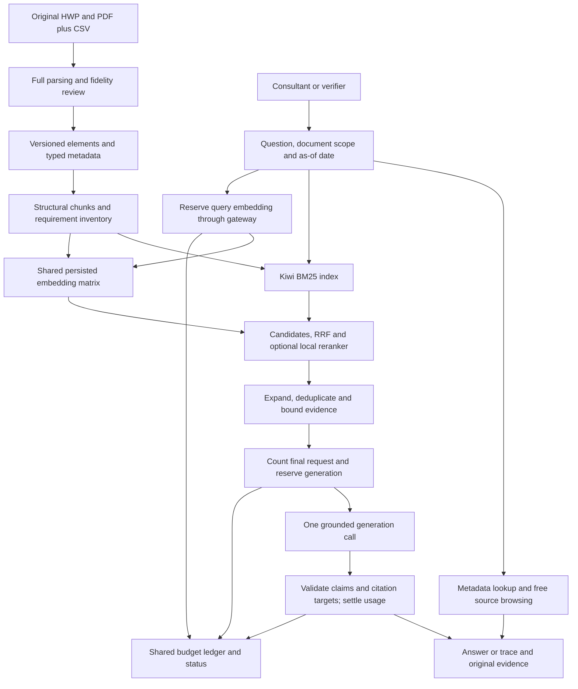

# RFP assistant end-to-end implementation overview

Build a usable internal assistant for 입찰메이트: find relevant historical RFPs, inspect their requirements and submission conditions, ask a scoped question, and open the original evidence behind the answer. Deliver the first complete workflow in two to three days, then improve it through measured failures while six members share a $20 OpenAI allowance for more than three weeks.

This overview owns the implementation sequence, planning decisions, and completion gates. The [shared implementation contracts](implementation-contracts.md) define package/file responsibilities, identity, service records, storage, authentication and billing states. The [research index](../../rag/index.md) owns the supporting investigations and primary sources. Each phase below produces a working increment; the first phase already connects original files, retrieval, generation, spending protection, and both interface purposes.

Status on 2026-09-30: research and source extraction trials are complete; application implementation, model comparisons, and browser validation have not started. Stack choices and numerical quality targets below are proposed defaults, not measured winners or additional user-approved decisions.

## Implementation documents and reading order

An implementing agent reads this overview, the shared contracts, its phase document and the preceding phase's actual handoff. Each phase specifies files, commands to implement, ordered work, failure behavior, verification and exit evidence. The commands are future implementation contracts until those phases create and execute them.

| Order | Document | Assignment |
| --- | --- | --- |
| Common | [Implementation contracts](implementation-contracts.md) | One package/service, shared records, stable evidence, ledger and role checks (no login) |
| 1 | [Guarded vertical slice](1-guarded-vertical-slice.md) | Original HWP/PDF to scoped answer, evidence, metered usage and both minimal entry points |
| 2 | [Corpus and retrieval](2-corpus-and-retrieval.md) | Full manifest/review coverage, incremental artifacts and measured keyword/dense/reranker selection |
| 3 | [Workflows and operations](3-workflows-and-operations.md) | Consultant/verifier completion, responsive requests, six-user spending and recovery correctness |
| 4 | [Evaluation and release](4-evaluation-and-release.md) | Reviewed difficult gold, frozen comparison/sealed test, real release evidence and runbook |
| 5 | [Team operation](5-team-operation.md) | Remaining weeks: persistent hosting, reconciliation, backups, regression, rollback and final handoff |

Phases 1–4 are the two-to-three-day delivery. Phase 5 prepares and governs subsequent use; it does not extend the mentor's delivery deadline. No agents, applications, paid calls or operational jobs have been launched by writing these documents.

## Goal and delivery boundary

The consultant workflow is search → select document/version → ask → inspect supported facts, conditions, unknowns, and citations → open the original. The verification workflow reproduces the same pipeline, exposes its intermediate evidence, and compares frozen runs without spending on generation by default.

The initial release includes complete source ingestion where supported, an explicit status for all 100 records, Korean keyword retrieval, one grounded generation call, stable evidence navigation, separate consultant and verification access, and a shared spending ledger. Dense retrieval and local reranking enter the active path when development measurements justify them. A useful two-day release can retain validated BM25 if those additions miss their gates.

This corpus supports historical discovery and document Q&A. Fresh opportunity collection, automatic company eligibility decisions, autonomous agents, fine-tuning, GraphRAG, a hosted vector database, and a separate frontend deployment are outside the first release. Add a component when a recorded limitation requires it.

## Requirements already established

| Date | Requirement | Consequence for the plan |
| --- | --- | --- |
| 2026-09-30 | Deliver a usable end-to-end system in two to three days | A vertical slice precedes wider retrieval experiments; every release has an inspectable user workflow |
| 2026-09-30 | Six members share $20 for more than three weeks | All paid stages and experiments use one gateway and cumulative ledger |
| 2026-09-30 | Usage percentage must be intuitive and update in real time | Money-based progress is primary; reservations and token details remain visible |
| 2026-09-30 | Research ingestion, chunking, architecture, gold data, retrieval, prompts, reranking, evaluation, and frontend before implementation | Reuse the documents under `docs/rag/`; phase checks reference their domain-specific rules |
| 2026-09-30 | Separate verification and practical-use frontends | Distinct entry points sharing the same pipeline |
| 2026-09-30, reaffirmed 2026-10-01 | No login | Every visitor gets every screen; a typed name attributes work; network reach is the only access control |
| 2026-09-30 | Write the overall plan under `docs/plan/end-to-end` using the reference plans | This numbered overview defines phase ownership and contracts without creating application scaffolding |
| Session instruction | Write UTF-8 without BOM | All new documents, extracted artifacts, and exports use this encoding; read the existing CSV with `utf-8-sig` |

The technical decisions below are planning recommendations. They do not imply that model access, hardware performance, or remaining academy credit has been verified.

## Verified starting point

Findings come from the [dataset audit](../../rag/project-and-data.md) and its [machine-readable evidence](../../rag/evidence/dataset-audit.json), inspected on 2026-09-30.

| Observed fact | Implementation consequence |
| --- | --- |
| No application code or dependency stack exists; 100 CSV records match 96 HWP and four PDF originals | Start with a small shared Python application and a 100-record ingestion manifest |
| Supplied CSV text totals 384,353 characters and is incomplete | Build retrieval from originals; use CSV metadata separately |
| Structured trials produced well-formed XML for 94 HWP files and text for all four PDFs, totaling 7,420,390 characters | Reuse this parser route, then inspect table fidelity and late-document content; character counts are neither tokens nor quality scores |
| Plain HWP conversion omitted table contents in inspected samples | Retain table cells, row/column relationships, merged spans, requirement IDs, and surrounding headings |
| AFSIS Cambodia and MILE HWP files failed structured conversion | Attempt approved conversion recovery; otherwise quarantine with a visible reason |
| Two source pairs are byte-identical but associated metadata conflicts | Deduplicate extraction/indexing by hash, preserve separate records and provenance, and group evaluation families |
| Publication dates range from 2021-10-08 to 2025-02-11 | Label historical data and make the as-of date explicit |
| Notice numbers/revisions, amounts, and bid dates have missing or questionable values | Keep unknown, zero, conflict, and absent evidence distinct; no inferred deadlines or institutions |
| Requirement codes repeat across documents; summary provenance is undocumented | Scope code lookup to document/version and cite original clauses rather than supplied summaries |

No academy-key calls were made during research. Prior spending, actual project dates, model permissions, billing-admin access, hosting environment, and available CPU/GPU capacity remain implementation inputs.

## Structure

Use one shared application process initially. Both frontend entry points call the same retrieval and answer functions, read the same index version, and use the same ledger. Offline indexing and evaluation jobs also use its paid-call gateway. Six disconnected local counters cannot describe a shared allowance in real time.

Metadata lookup, keyword search, requirement inventory browsing, and citation opening remain available when paid stages are blocked. Comparisons select documents explicitly and retrieve within each scope. Exhaustive requirement lists use the structured inventory: top-k passages cannot prove completeness.

### Recommended starting components

| Component | Default | Change only when |
| --- | --- | --- |
| Original parsing | Structured `pyhwp` XML and PyMuPDF; approved/native conversion fallback | Original checks expose missing or malformed content |
| Metadata, elements, traces, and allowance | PostgreSQL 18.6 only (`bidmate_app`); short atomic write transactions, database-wide advisory lock for the paid gateway. SQLite retired on 2026-10-04 after a validated final import; the last `.sqlite3` file is a cold archive, and rollback is a verified `pg_dump` restore | A measured failure of the single PostgreSQL server |
| Korean keyword retrieval | Kiwi plus `rank_bm25`, typed filters, scoped exact identifiers | Development failures show a concrete tokenizer/query limitation |
| Dense retrieval | `text-embedding-3-large` at a fixed 1,536 dimensions in pgvector 0.8.6; exact cosine search serves (HNSW recall@20 stayed below 0.99 for scoped queries even at `ef_search` 400) | HNSW, or a successor, reaches recall@20 ≥ 0.99 against exact search in every scope group |
| Fusion | `keyword_first`: the BM25 top 6 keep their order, then weighted RRF (`1 / (60 + rank)`, dense weight 1.0) fills the rest. 50 candidates per channel and after fusion; 10 evidence units (4,000/4,800 tokens). Zero new critical failures against keyword-only K1 at the same limits on the 55-question pilot (55/55 complete) and the 88-question whole-corpus set (73/88 against 71/88); 20–30 units failed. All-documents routing needs a restated title term found in fewer than four titles, so generic words such as 대학교 or 사업 route nothing (run `H-0fffb2a6ec`) | A frozen comparison passes the same gate with better nDCG@5 or complete support |
| Reranker | Local `BAAI/bge-reranker-v2-m3` (CUDA) measured on 2026-10-04 at 10–30 evidence units; not served, every setting failed the fusion gate (new critical failures or nDCG@5 0.8948 against 0.9405) | A reranker setting passes the fusion gate and the warm latency gate |
| Answer generation | `gpt-4o-mini`, one Chat Completions call with strict structured output | A controlled `gpt-4.1-mini` comparison repairs measured errors affordably |
| Frontends | One Next.js app in `web/` (질문하기, 검증, 데이터셋 만들기) over a FastAPI wrapper of `service`, served by one process, no login. Replaced the Streamlit pages on 2026-10-02 | Browser-tested requirements exceed the shared application's capabilities |
| Observation | Persisted traces and ledger exports | Trace volume warrants Langfuse; existing proxy infrastructure makes LiteLLM practical |

Dependencies and exact versions are pinned during implementation after a Windows smoke check. The smallest useful alternative remains original ingestion, scoped BM25, one grounded answer, and the ledger. Every additional component must preserve that path.

## Shared contracts

Agree on these before the six workstreams connect. Keep them as small typed records and persisted fields; avoid parallel definitions of source identity, request state, or spending.

| Contract | Required meaning |
| --- | --- |
| Document | Stable internal `doc_id`; source hash/version; separate CSV record identity; raw and normalized metadata with provenance and quality flags |
| Ingestion | Separate parse state (`pending`, `parsed`, `quarantined`) and review state (`unreviewed`, `sample_checked`, `reviewed`, `needs_recovery`), parser/config version, warnings, and recovery reason; parsed does not mean faithful |
| Source element | Stable element ID within a source version; section path, text/table representation, requirement code, and original location |
| Evidence | Document/version plus element and quoted span or cell coordinates; PDF physical page/bounding box where available, HWP section/table location without invented page numbers |
| Chunk and index | Chunk ID is configuration-dependent; source evidence is stable. Index manifest binds source hashes, parser/chunker settings, embedding model/dimensions, and row ordering |
| Request | Attributed member name, request ID, generation ID, attempt ID, mode, document/version scope, as-of date, and configuration snapshot |
| Answer | Supported claims with evidence IDs, conditions, unknowns, conflicts, and status; every citation resolves to managed original evidence |
| Trace | Stage outputs, ranks/scores, selected evidence, final token count, model/prompt/index versions, timings, errors, and paid attempt identities |
| Usage | Raw provider usage, model/rate snapshot, estimated and settled microdollar cost, reservation, member/purpose, response ID, billing state, and reconciliation watermark |

Keep missing metadata, absent original evidence, parsing failure, retrieval failure, ambiguous scope, and conflicting sources as different outcomes. Preserve integer KRW amounts, units, VAT qualifications, mandatory wording, and date-only versus timestamp semantics. Identical bytes can share extraction while their conflicting metadata remains visible.

An answer attaches to the scope captured when its request began. Changing the selected document, question, or mode invalidates its permission to render on the current screen; server-side cost settlement still finishes. Validate source access on the server and resolve downloads by managed document IDs.

### Shared resource ownership

Create the SDK client and immutable index resources once through the shared service's bootstrap/resource cache, rather than on every request (the API's lifespan holds them). The service owns their lifecycle; sessions supply the typed name for attribution and the scope. Verify supported concurrent client use before sharing it; bound local reranker work to available hardware. Open and explicitly close database connections per operation, keeping transactions out of network inference.

On controlled shutdown, stop accepting paid work, finish or persist outstanding attempt states, and close the SDK client through its owner. A crash cannot guarantee cleanup, so startup recovers unresolved reservations. Browser disconnection neither closes shared resources nor establishes a zero-cost attempt.

## Retrieval and generation policy

Start with source structure: headings, requirement blocks, table headers, cells, and exceptions. Aim for 300–700 tokens per chunk with a hard limit of 800 including headings; use 64-token overlap only when oversized prose needs splitting. Compare this with fixed 256/32, 512/64, and 800/96 token/overlap baselines using the same reviewed source-span labels. Details belong to [chunking](../../rag/chunking.md) and [preprocessing](../../rag/preprocessing.md).

For the hybrid candidate, retrieve BM25 top 20 and dense top 20, fuse to top 20, optionally rerank, then pack up to six evidence units. Start with a 3,000-token evidence target and a 5,000-token hard ceiling after expansion and deduplication. Count the final serialized prompt before reserving generation, and cap output at 800 tokens. These are experimental defaults; record changes with the run.

Filters and exact identifier lookup precede free-form matching. A code such as `SFR-001` requires document/version scope; preserve source irregularities and avoid suffix matches. For multi-hop or comparisons, allow at most two bounded deterministic subqueries and record missing support per document. Use detailed clauses rather than contents entries. See [retrieval](../../rag/retrieval.md).

The [prompt contract](../../rag/prompts.md) separates trusted instructions from untrusted document text, supplies explicit scope and an evidence-ID allowlist, and requires Korean answers supported by the supplied evidence. Instructions inside RFP text are data. Validate output shape and citation ownership before marking an answer complete; a valid citation link alone does not prove its claim is supported.

Promote the [reranker](../../rag/reranking.md) only with development `nDCG@5` improvement of at least 0.03, no critical regression, and at most one second of added warm p95 latency under six users. Failure to meet the gate keeps the bypass active. These thresholds and hardware feasibility must be measured.

## Shared allowance and real-time status

The primary indicator is cumulative dollar cost divided by $20, because input, output, cached input, and embedding tokens have different prices. Show settled estimates, pending reservations, token details, per-member attribution, pacing, and the last reconciliation time. Label the tracked scope; local estimates are not verified provider credit.

| Purpose | Proposed envelope |
| --- | --- |
| Initial/incremental embeddings | $1 |
| Gold drafting and limited paid evaluation | $3 |
| Interactive team use | $12 |
| Untouched safety reserve | $4 |

Use a $16 operational cap and actual project start/end dates. A 28-day horizon is only a planning example. Record prior allowance spending before enabling calls and scale allocations to the real remainder. This cumulative allowance does not reset when a provider's monthly budget resets.

Every paid stage follows one contract: attribute → count bounded input/output → reserve atomically → persist attempt → dispatch → settle once. Reserve query embeddings before dense search; reserve generation after final evidence packing, assuming uncached input plus maximum output. Use a short PostgreSQL transaction that locks the ledger row and release its lock before inference. Account for every retry, disabling or bounding hidden SDK retries.

Settlement replaces a reservation with measured cost and returns the unused portion atomically. Duplicate completion cannot bill twice. Disconnects, timeouts, cancellations, or missing final usage remain pending/unknown until reconciled; TTL expiration alone cannot release them. Persist price snapshots and use integer microdollars or Decimal. Recover pending attempts on restart.

The UI reads the ledger every one or two seconds and after local changes. Polling is read-only and cannot dispatch generation. A running call displays its reserved maximum; exact provider token usage settles at completion. Reconciliation uses a closed interval and records only the difference from local cost for that same scope and interval.

Direct academy-key use outside the gateway is invisible until reconciliation. Verify owner permissions or obtain dated usage exports; do not assume an inference key can read billing. Keep the raw key server-side. At the operational cap, block new paid stages while free search and original browsing continue. The [budget document](../../rag/budget.md) owns pricing, formulas, provider-control limitations, cache keys, and failure checks.

## Two interfaces, one pipeline

| Interface | Working increment | Completion evidence |
| --- | --- | --- |
| Consultant | Search/filters, readable project list, explicit selected scope, grounded answer, conditions/unknowns, clickable evidence and original download, persistent budget status | A consultant finds a late-document requirement and verifies its answer in the correct original without interpreting retrieval scores |
| Verification | Retrieval-only default, stage trace, frozen configuration/run comparison, reviewed labels/corrections and exports; separate estimated paid actions | A reviewer reproduces a failure, distinguishes ingestion from retrieval/generation, and compares runs without accidental paid calls |

Both entry points exist in the first slice; expand their workflows in phase 3. There is no login; sealed labels are never served to the verifier page, and owner actions require a reason and an audit event. Use Korean UI labels and answers, readable long titles, accessible controls, and explicit loading, insufficient-evidence, clarification, conflict, budget-blocked, and error states.

During implementation, validate purpose/layout first, then real-browser spacing and interactions, typography, accessible colors, and remaining space. Do not claim visual measurements before a browser check. The [frontend plan](../../rag/frontend.md) owns detailed state, polling, accessibility, and acceptance scenarios.

## Phases and working increments

These are dependency milestones within a two-to-three-day schedule, not four additional days. Ingestion, interface work, and gold review can proceed in parallel once the contracts are agreed. The linked phase documents provide the executable work sequence; a handoff must record actual outcomes before a successor assumes a gate passed.

| Phase | Timing | Working increment | Exit gate |
| --- | --- | --- | --- |
| [1. Guarded vertical slice](1-guarded-vertical-slice.md) | Day 1 | One supported HWP and PDF through structural ingestion, scoped BM25, both basic entry points, evidence navigation, one metered answer, and a visible failure state | A reviewed late-document/table fact is answered and opened in each original; the gateway exists before the first paid call; all 100 records have manifest status |
| [2. Corpus coverage and retrieval comparison](2-corpus-and-retrieval.md) | Day 1–2 | Shared full-source artifacts, quality-reviewed supported coverage, duplicate/provenance handling, structural chunks, exact lookup; dense/hybrid and reranker trials | Report actual reviewed coverage and unresolved files; freeze pilot runs and choose the active retriever from quality, latency, and cost |
| [3. Usable consultant and verification workflows](3-workflows-and-operations.md) | Day 2 | Filters, unknown/conflict handling, scoped comparisons, requirement inventory, frozen traces/exports, audited owner actions (no login), shared live usage, interruption/restart behavior | Browser scenarios pass; six sessions do not overspend or attach stale answers to new scopes; exhausted-budget free paths still work |
| [4. Evaluation and release evidence](4-evaluation-and-release.md) | Day 2–3 | Reviewed gold expansion, controlled finalist generation, sealed evaluation where ready, integrated mentor demonstration and handoff | Record metrics, denominators, costs, versions, coverage, failure examples, and unresolved risks; label pilot-only evidence accurately |
| [5. Shared team operation](5-team-operation.md) | Remaining weeks | Persistent deployment, backups/restore, provider reconciliation, measured regressions and final handoff | Owner and backup owner can operate/recover without resetting allowance or duplicating paid work |

### Phase 1: first complete user path

Timebox structured HWP converter and representative table checks to the first two hours. Reuse the research route, inspect original content, and put the two known failures into a recovery queue. Build stable source evidence, typed metadata, scoped Korean BM25, and original browsing.

Before any paid call, configure dates/cap, prior spending, and reservation/settlement. Recheck current model access and pricing at implementation time. Prepare 24 independently reviewed development questions, including table and late-document facts. Complete the smallest consultant question/evidence screen and verifier retrieval trace, then demonstrate a metered grounded answer from HWP and PDF.

Early demonstration scope may be a reviewed subset, labeled explicitly. A 100-file manifest is required immediately; wider reviewed source coverage belongs to phase 2. The first slice includes every layer rather than waiting for the final day to connect the frontend.

### Phase 2: trustworthy corpus and cheaper comparisons

Expand parsing and original fidelity checks across supported files; prioritize requirements, monetary/date conditions, tables, and document tails. Recover failed HWP through verified conversion if available; otherwise keep their unavailable status visible. Retain metadata conflicts while sharing hash-identical artifacts.

Run whitespace BM25, Kiwi BM25, dense-only, and hybrid retrieval on frozen development questions without generation. Reuse query embeddings and one persisted corpus index. Compare chunking and reranking as separate changes. Adopt an added stage only for a measured benefit; mark the active mode and fallback in traces.

### Phase 3: everyday usability and operational correctness

Complete consultant discovery, scoped answers/comparisons, requirement inventory, original downloads, and meaningful unknown/conflict states. Complete verifier experiments, stage inspection, corrections, and exports with restricted sealed-test access. Persist request snapshots and prevent duplicate submission.

Exercise changed scope during a response, six concurrent near-cap reservations, duplicate settlement, a billed retry, interrupted streaming, restart recovery, external-spend adjustment, changed prices, and cap exhaustion. Check read-only budget polling under a long request. Server-side settlement must survive a disappearing browser session.

### Phase 4: difficult evidence and a reviewable release

Grow the reviewed gold target to 120 questions: 60 development and 60 sealed test, grouped by original document family. Include paraphrases, repeated codes, table/numeric facts, same- and cross-document multi-evidence, genuine missing facts/false premises, and revision/duplicate conflicts. LLMs draft candidates; a person independently verifies the full original, quoted evidence, numbers, units, conditions, and answerability. Converter failures are recovery cases, not proof a fact is absent.

Select two development answer finalists at most, holding model/prompt/token limits constant for retrieval comparisons. Keep test questions and labels out of retrieval content and prompts, while all source documents remain searchable. Evaluate the sealed set only after selection. Review disputed critical facts independently and limit paid judge calls to a calibrated sample.

If only two days are available or review remains unfinished, release the supported usable path with exact coverage and the reviewed pilot results. Do not call unreviewed drafts gold or claim final reliability from a partial run. See [gold construction](../../rag/golden-dataset.md), [evaluation](../../rag/evaluation.md), and [delivery sequencing](../../rag/delivery-plan.md).

## Six workstreams

| Workstream | Owns | Shared boundary |
| --- | --- | --- |
| Ingestion | Original parsing, table fidelity, metadata provenance, recovery manifest | Versioned documents/elements and evidence locations |
| Retrieval | Chunking, Kiwi BM25, exact codes, dense matrix, fusion/reranker comparisons | One index manifest and scoped retrieval result contract |
| Generation and budget | Prompt/output validation, paid-call gateway, ledger, pricing/reconciliation | Request/attempt identities and exactly-once settlement |
| Consultant frontend | Search, selection, answers/evidence, live allowance | Calls shared services; owns current-screen generation state |
| Verification frontend | Traces, frozen run controls, explicitly estimated paid actions, exports | Same pipeline and versions; no independent spending counter |
| Gold and evaluation | Source-family split, reviewed labels, metric definitions, release report | Stable original evidence labels, sealed access, recorded costs |

These are proposed team responsibilities, not work already assigned. Source identity and gateway contracts are the first coordination task. Split review of 120 target questions as 20 per member, with an independent second check for disputed deadlines, amounts, institutions, and mandatory conditions.

## Verification and release gates

All values below are proposed targets. Actual results, sample counts, and failures must appear in the release report.

| Area | Required check or target |
| --- | --- |
| Ingestion | Every record has status; claimed supported coverage has original fidelity checks; unresolved files and provenance conflicts are visible |
| Retrieval | Answerable single-evidence hit@20 ≥ 90%; multi-evidence complete coverage@20 ≥ 80%; report per-type results and wrong-document/version errors |
| Answers | Reviewed required-claim correctness ≥ 90%; citation precision ≥ 95%; managed source links resolve; inspect unsupported claims separately |
| Negative/ambiguous cases | Correct handling ≥ 90%, distinguishing absence, ambiguity, conflict, unavailable parsing, and retrieval failure; report unnecessary refusals |
| Critical facts and scope | No observed wrong deadline, amount, mandatory condition, or institution, and no selected-scope leakage in reviewed cases |
| Runtime | Measure warm/cold behavior and six-user concurrency; initial warm p95 targets are retrieval < 2 seconds and full answer < 15 seconds |
| Budget | Every paid stage/retry is accounted for; atomic reservations enforce the cap; unresolved billing stays conservative; free routes survive exhaustion |
| Frontend | Both workflows complete; stale results, unsafe paths, unaudited owner actions and refresh-triggered paid calls are prevented |

Report binary numerators/denominators and Wilson intervals; use document-family bootstrap intervals for ranked metrics when practical. A 60-question test changes by about 1.67 percentage points per question and cannot establish universal reliability. Include indexing, generation, retries, and judging in cost totals; record configuration and hardware with latency.

The release handoff contains a run/configuration manifest, ingestion coverage/recovery list, reviewed dataset/split, metric and spending report, documented launch/configuration instructions, and a consultant/verifier walkthrough with known failure examples. These are future deliverables, not artifacts verified by writing this plan.

## Boundaries and outstanding measurements

| Unknown or risk | Resolve in | Fallback or consequence |
| --- | --- | --- |
| Prior academy spending, actual horizon, permissions, and current prices | Phase 1 before paid dispatch | Configure the true remainder; retain free search while paid access is unavailable |
| HWP table fidelity and two converter failures | Phases 1–2 | Verified conversion or explicit quarantine; no claim of complete corpus coverage |
| Conflicting institution/deadline metadata | Phase 2 | Preserve provenance and show conflict until original/notice review resolves it |
| Korean retrieval quality and dense benefit | Phases 2 and 4 | Scoped Kiwi BM25 remains the usable baseline |
| Local reranker memory, Windows loading, and concurrent latency | Phase 2 | Bypass reranking if its gate fails |
| Hosting, network exposure and shared-client concurrency | Phases 1 and 3 | One controlled team deployment without login; its network reach decides who can spend; no private-key browsers |
| Gold review time and sealed-test sample size | Phase 4 | Deliver accurately labeled pilot evidence and continue independent review |
| Billing reconciliation access and external-key spending | Phases 1 and 3, then ongoing | Dated owner exports/manual adjustments; visibly stale or incomplete provider reconciliation |

During the remaining weeks, fix extraction/provenance, scope/identifier errors, missing evidence, context packing, and unsupported claims before changing models. Reindex changed unique sources only, share cached artifacts, add hard regression cases from consultant use, and schedule affordable retrieval-first comparisons. Review pacing and reconciliation regularly without rerunning every paid metric daily.

The reference structure follows `docs/plans/comic/0-overview.md` and `docs/plans/studio/0-overview.md` in `C:/Users/dasdk/PycharmProjects/ai-generation`: goal, structure, shared contracts, established decisions, phased working increments, and outstanding measurements. Their unrelated product decisions are not adopted here. Detailed technical evidence remains in the [research source register](../../rag/sources.md).
