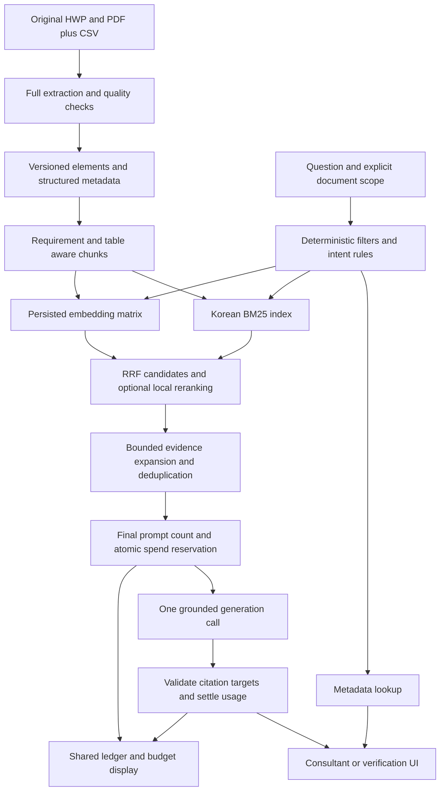

# RAG architecture for procurement discovery and document Q&A

Proposed design: combine typed procurement metadata with source-grounded passage retrieval. Exact dates, amounts, organizations, and notice identity should be handled by deterministic filters and lookups. Detailed requirements and explanatory comparisons need RAG. This division saves calls and prevents the model from guessing fields the CSV already supplies.

## A closely related implementation

The MIT 2025 capstone [AI-powered RFx Intelligence for Strategic Supplier Excellence](https://ctl.mit.edu/sites/ctl.mit.edu/files/theses/zaunicknastasja_170045_5333547_SCM15_Zaunick_Paredes_CapstoneReport.pdf) built the Raffa procurement chatbot over historical RFx documents. Section 3.2, physical PDF page 25, describes Python, LangChain, Streamlit, and Pinecone. Its evaluation discusses metadata, contextual relevance, answer accuracy, complex questions, and response structure.

The transferable pattern is organizing procurement evidence with metadata and evaluating actual buyer questions. This project instead starts with Korean public-sector RFPs, requirement-code collisions, HWP tables, and a very small API allowance. The capstone does not validate our parser, Korean retriever, or expected score. We do not need its hosted database choice to reuse its workflow.

[CUAD](https://arxiv.org/abs/2103.06268), an expert-annotated contract-review dataset, is an adjacent example of annotating document clauses for specific business questions. Adopt explicit source spans and expert review; do not transfer English legal-contract labels as a Korean procurement benchmark.

## The complete flow

Query embeddings also pass through the spending gateway before retrieval. The diagram's generation reservation occurs after the final context is assembled; it is not the only paid stage.

## Request modes

| User need | Route | Guard |
| --- | --- | --- |
| Filter projects by budget or institution | Typed SQL filters plus keyword search | Unknown values do not meet numerical/date conditions |
| Ask a selected project's recorded budget | Metadata lookup, with provenance | Do not claim VAT treatment unless the original supports it |
| Explain a requirement or submission rule | Retrieve within the selected document/version | Cite detailed clauses, not merely a contents entry |
| Compare selected RFPs | Retrieve evidence per selected document | Ensure every compared document has evidence or a missing-data entry |
| Enumerate every requirement | Structured requirement inventory | Top-k retrieval is not a completeness guarantee |
| Decide whether bids are open today | Historical-data notice unless fresh data exists | Never describe 2024 notices as currently open by default |

Ambiguous document names should trigger a choice in the UI. Do not silently scope an ambiguous query to the first search hit. Cross-document exploration is a separate explicit mode. Multi-hop questions can use up to two bounded deterministic subqueries; do not add a paid query-rewriting agent to every question.

## Minimal components to reuse

Use Python standard CSV, Unicode, hashing, XML and SQLite tools; pyhwp for the structured HWP trial; PyMuPDF for PDF; Kiwi and `rank_bm25` for lexical retrieval; OpenAI SDK for embeddings and one answer call; NumPy for cosine scoring; and FastAPI with a Next.js app for the interfaces (Streamlit until 2026-10-02). There is no existing application dependency stack to preserve.

For this corpus, exact vector scoring over a normalized, persisted matrix is a reasonable first measurement. Store document/chunk metadata in SQLite and the array with a matching version manifest. Benchmark actual chunk count and memory before adding FAISS or a database server. Do not load arbitrary user-supplied pickle files.

Persist artifacts keyed by source hash, parser/chunker settings, embedding model/dimensions, and index version. All six members reuse one generated corpus and index. Ship one shared spending gateway for ingestion, experiments, and user requests; six disconnected apps cannot truthfully present a real-time shared allowance.

Defer GraphRAG, autonomous agents, fine-tuning, hosted vector storage, and a separate React deployment until measured needs justify them. A failed ingestion route and a missing citation need attention before an advanced orchestration layer.
